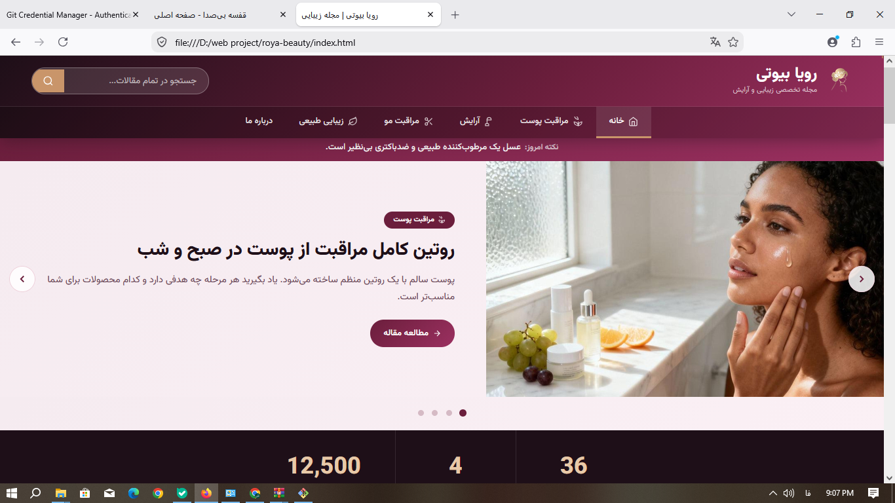

💄 Roya Beauty | رویا بیوتی

A modern Persian RTL beauty magazine website focused on beauty, makeup, skincare, and lifestyle content, built with HTML, CSS, JavaScript, and Vazirmatn.

رویا بیوتی یک مجله تخصصی زیبایی و آرایش فارسی و راست‌چین است که با هدف ارائه محتوای کاربردی و جذاب در زمینه زیبایی، آرایش، مراقبت از پوست و سبک زندگی طراحی شده است.

---

🌐 Live Demo

👉 "View Live Website" (https://shabnamnoori.github.io/roya-beauty/)

نسخه آنلاین پروژه از طریق GitHub Pages در دسترس است.

---

🖼️ Project Preview

---

✨ Features

- 💄 Beauty and makeup magazine interface
- 💅 Makeup and beauty content
- 🧴 Skincare and beauty topics
- 📰 Magazine-style content sections
- 📱 Persian RTL interface
- 🎨 Modern and elegant visual design
- 🔤 Persian typography using Vazirmatn
- ⚡ Interactive elements using JavaScript
- 📐 Responsive web design

---

🛠️ Technologies

- HTML5
- CSS3
- JavaScript
- Vazirmatn Font

---

🎨 Design

The project uses a Persian RTL (Right-to-Left) layout with a modern, elegant, and beauty-focused visual design.

این پروژه با رابط کاربری فارسی و راست‌چین طراحی شده و از طراحی مدرن، ظریف و متناسب با فضای مجله‌های تخصصی زیبایی و آرایش استفاده می‌کند.

---

🌐 Language

Persian (فارسی)

---

📌 Project Type

Frontend Web Project

---

👩🏻‍💻 Author

"Shabnam Noori" (https://github.com/Shabnamnoori/)

---

⭐ If you like this project, feel free to explore the repository.

رویا بیوتی — دنیای زیبایی، آرایش و مراقبت از خود.
